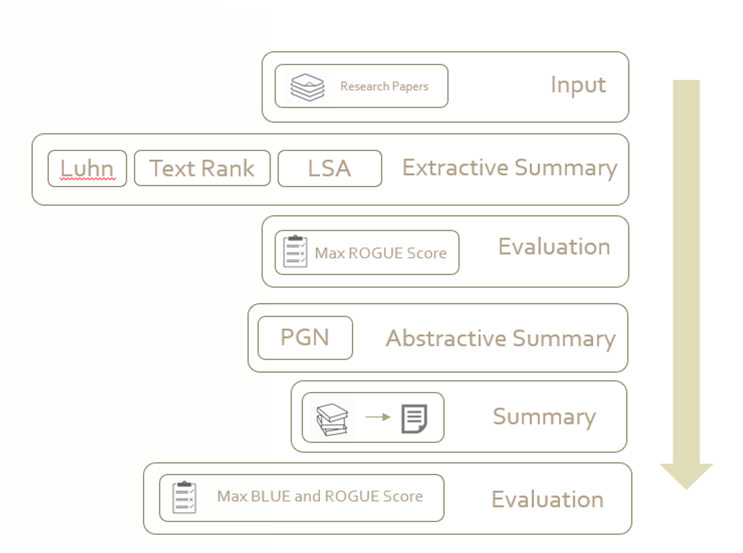

## Research Papers in a nutshell

## How to run

```
python main.py --summarizer=extractive --mode=train
```

```
python main.py --summarizer=abstractive --mode=train
python main.py --summarizer=abstractive --mode=test
```


```
python main.py --summarizer=both --mode=test
```

## MODEL FLOWCHART
