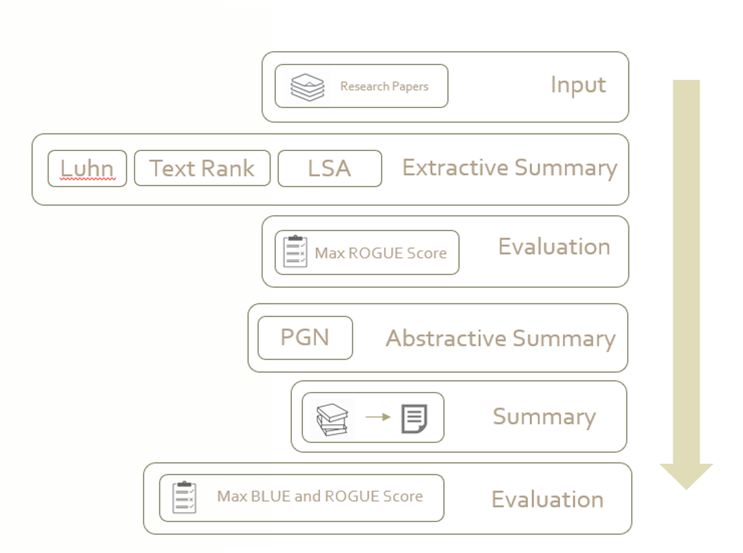

<html><head>
        <link rel="stylesheet" href="https://github.com/abhishah901/IR-project/blob/master/index.css">
        
        
        
    </head>
    <body>
    

     

     

     

        
       	
    	
    

    

<h1 class="header">Research Papers In a nutshell</h1><h2>IR Final Project</h2>
Shyam Subramanian, Rashmi Singh, Abhishek Shah, Karthika Suresh

    
 
    

    
PROJECT PROPOSAL

    
ISSUES TO ADDRESS

    
SOLUTION FLOWCHART

    
EXPERIMENTS

    
RESULTS

CONTACT

    

        <h1 style="color:black;">What we are trying to do?</h1>
        
Summarize research papers by either extractive or abstractive methods to capture important keypoints from them.

    

    

    
PROJECT PROPOSAL

    

        
The function of our tool is to summarize research papers by extracting important sentences from them. The goal here is to find an automated way of quantifying the significance of each sentence so that only most significant sentences are present in the summarized version. The order of sentences in summary needs to be sensible without loss of continuity. We also intend to provide a downloadable PowerPoint of the summarized version of research paper. The created summary would be such that it is easier for people to understand the main idea and its usefulness will find a middle ground between reading only the abstract and reading the entire research paper.

	

    
ISSUES TO ADDRESS

    

    <li>No Ground Truth Summaries for Research papers</li>
    <li>Research Papers are Lengthy</li>
    <li>Research papers are of different lengths</li>
    <li>Proper Transfer Learning</li>
    <li>Mathematical Formulas, Images and other unstructured data</li>

    
SOLUTION FLOWCHART

    

        </img>
    

    
EXPERIMENTS

    

        TextRank SummarizerLUHN SummarizerLSA SummarizerPointer Generator Networks
        
RESULTS OF TEXTRANK

        
RESULTS OF LUHN

        
RESULTS OF LSA

        
RESULTS OF PGN

        
RESULTS

        

        ADD RESULTS HERE
        

    
CONTACT

    
<li>Email: ssubramanian2@wpi.edu</li><li>others@wpi.edu</li>    

</body></html>
